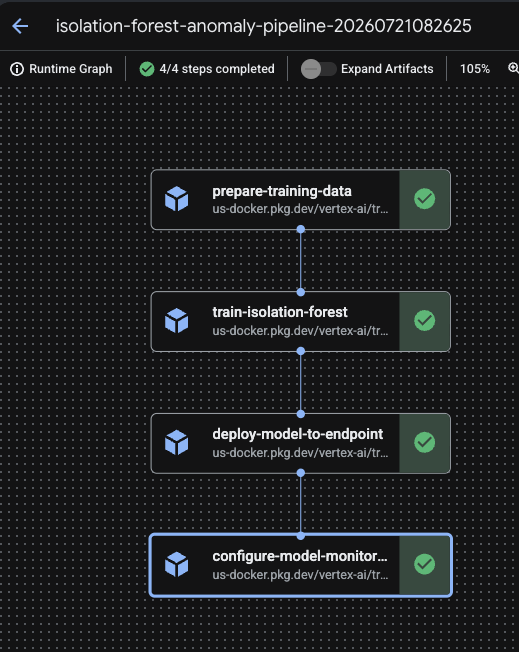
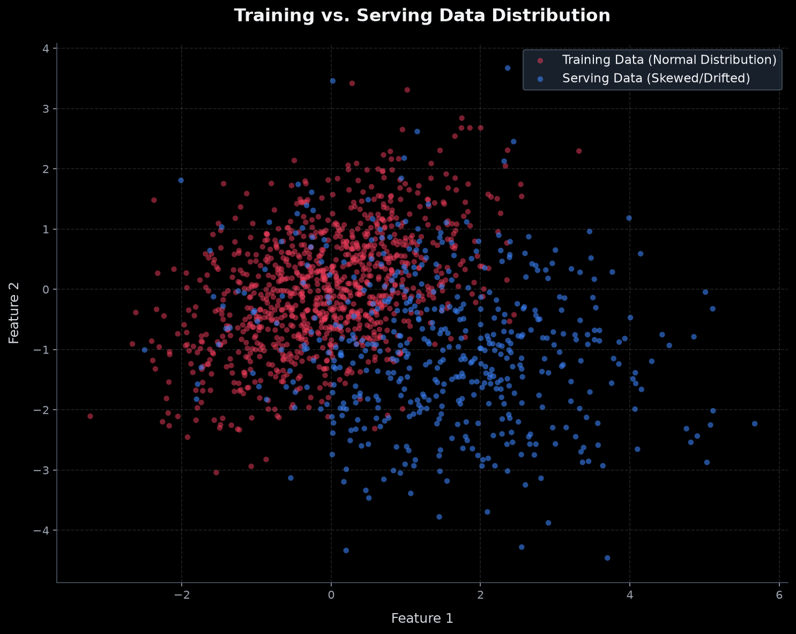
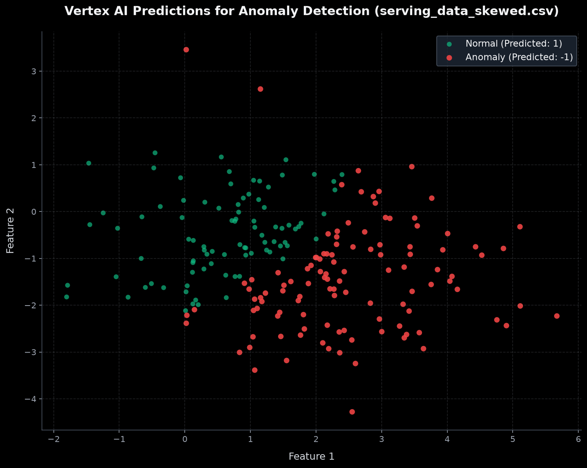
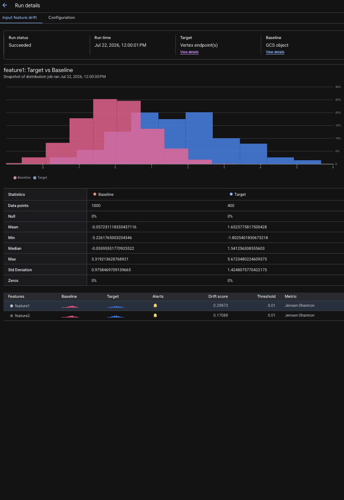
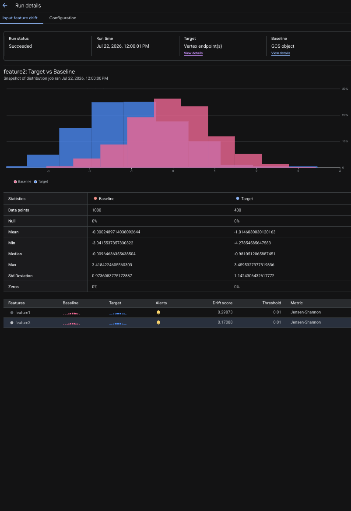
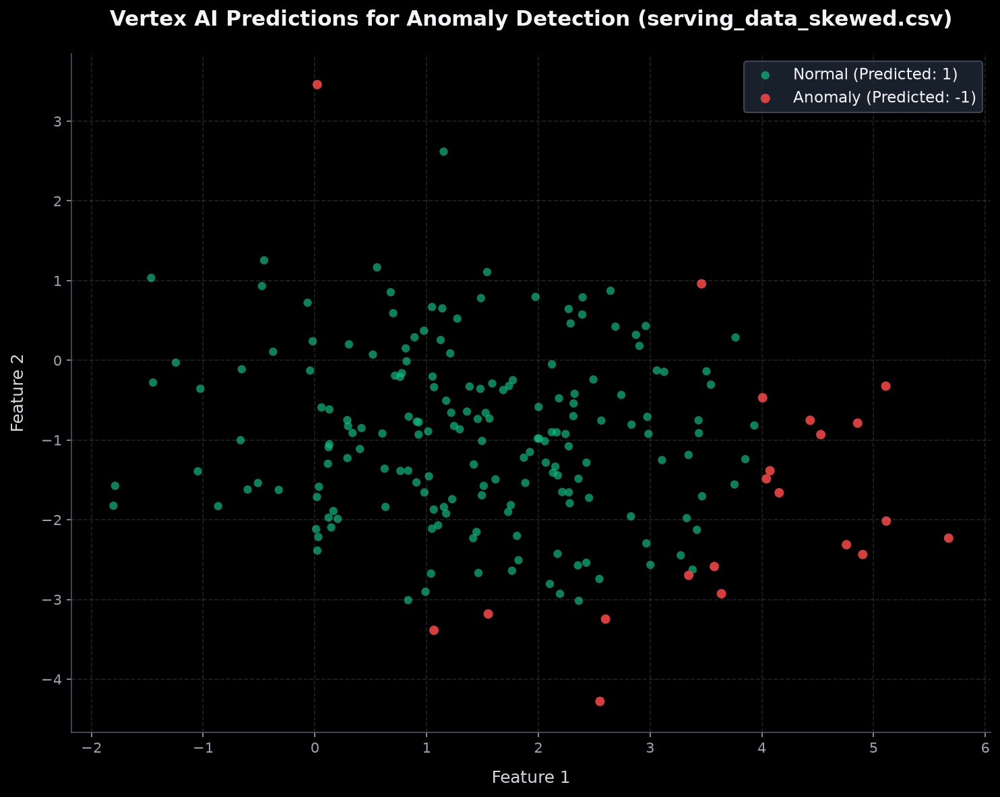

# Gemini Enterprise Agent Platform Anomaly Detection Pipeline with Model Monitoring & Retraining

This project implements an end-to-end MLOps pipeline on Google Cloud using Gemini Enterprise Agent Platform. It trains an **Isolation Forest** (unsupervised anomaly detection) model, deploys it to a Gemini Enterprise Agent Platform Endpoint, monitors the endpoint for training-serving skew, and automatically triggers a retraining pipeline when skew is detected.

All resources are provisioned and managed via **Terraform**, fully compatible with GCP **Infrastructure Manager** and categorized with **Labels**.

## Cloud-Native Architecture



1. **Declarative Terraform**: Defines GCS buckets, the Gemini Enterprise Agent Platform Endpoint, Pub/Sub alerts, Cloud Logging routers, and the retraining trigger Cloud Function. All resources are tagged with common metadata labels.
2. **Kubeflow Pipeline (`pipeline/`)**: Packages the core machine learning logic. On run, the pipeline executes the following steps:
   * **Prepare Training Data (`prepare-training-data`)**: Downloads the raw baseline dataset from Google Cloud Storage and prepares it for training.
   * **Train Isolation Forest (`train-isolation-forest`)**: Trains an unsupervised scikit-learn Isolation Forest model on the baseline training data, packages the trained model, and uploads the joblib artifact back to GCS.
   * **Deploy Model to Endpoint (`deploy-model-to-endpoint`)**: Registers the new model version in the Gemini Enterprise Agent Platform Model Registry, configures a Gemini Enterprise Agent Platform Endpoint, deploys the registered model to the endpoint with a 100% traffic split, and automatically undeploys any old model versions to release resources.
   * **Configure Model Monitoring (`configure-model-monitoring`)**: Provisions or updates the Gemini Enterprise Agent Platform Model Deployment Monitoring Job. This job reads endpoint prediction logs from BigQuery and continuously monitors them for statistical skew against the baseline training data.
3. **Retraining Loop (`trigger_function/`)**:
   * Skew alerts log to Cloud Logging.
   * A Cloud Logging Sink routes these logs to a Pub/Sub topic.
   * The Pub/Sub topic triggers a Gen 2 Cloud Function.
   * The Cloud Function executes the KFP Pipeline to retrain the model on updated training data.

---

## File Structure

```text
├── data/
│   ├── training_data.csv          # Normal distribution baseline data
│   └── serving_data_skewed.csv    # Skewed data to trigger drift detection
├── photo/                         # Visual assets for architecture & results
├── pipeline/
│   ├── pipeline.py                # KFP Pipeline definition
│   └── pipeline.yaml              # Compiled pipeline spec (ready for Gemini Enterprise Agent Platform)
├── scripts/
│   ├── generate_data.py           # Generates synthetic CSV data
│   └── predict.py                 # Client to send prediction requests
└── terraform/
    ├── main.tf                    # GCP providers, GCS buckets, API activation
    ├── variables.tf               # Terraform input variables
    ├── gemini_platform.tf         # Gemini Enterprise Agent Platform Endpoint
    └── trigger.tf                 # Pub/Sub, Log router, Cloud Function (Gen 2)
```

---

## Getting Started

### Prerequisites

1. Install the [Google Cloud SDK](https://cloud.google.com/sdk/docs/install).
2. Authenticate with your Google Cloud account:
   ```bash
   gcloud auth login
   gcloud auth application-default login
   ```

---

## Deployment Option A: Google Cloud Infrastructure Manager (Recommended)
This method executes your Terraform configuration directly in the cloud on Google's managed Infrastructure Manager, bypassing local execution security policies (like Santa).

1. **Enable the Infrastructure Manager API** in your project:
   ```bash
   gcloud services enable config.googleapis.com
   ```
2. **Deploy the configuration** from the `terraform/` directory:
   ```bash
   cd terraform
   gcloud infra-manager deployments apply anomaly-detection-deployment \
       --local-source="." \
       --location="us-central1" \
       --input-values="project_id=YOUR_PROJECT_ID" \
       --service-account="projects/YOUR_PROJECT_ID/serviceAccounts/infra-manager-sa@YOUR_PROJECT_ID.iam.gserviceaccount.com" \
       --project="YOUR_PROJECT_ID"
   ```
3. You can track this deployment under **Infrastructure Manager** in your GCP Console.

---

## Deployment Option B: Local Terraform CLI
If you prefer to run Terraform on your local machine:

1. **Install Terraform** on your machine.
2. Navigate to the `terraform/` directory:
   ```bash
   cd terraform
   terraform init
   terraform apply -var="project_id=YOUR_PROJECT_ID"
   ```

---

## How to Test and Verify

Since the Endpoint is deployed empty initially, you must trigger the pipeline for the **first time** to deploy your model and configure monitoring.

### 1. Trigger the Initial Run
Publish a trigger message to the retraining Pub/Sub topic to launch the first KFP run:
```bash
gcloud pubsub topics publish anomaly-retraining-alerts --message="{\"initial-trigger\": true}"
```
*Wait for the Gemini Enterprise Agent Platform Pipeline job to finish in your GCP Console. This will deploy the model and set up the monitoring job.*

### 2. Send Normal Traffic
Run the prediction client to send baseline prediction queries. This populates Gemini Enterprise Agent Platform's prediction logs:
```bash
python3 scripts/predict.py --project YOUR_PROJECT_ID --data-path data/training_data.csv
```

### 3. Simulate Training-Serving Skew
Send prediction requests using the skewed serving dataset:
```bash
python3 scripts/predict.py --project YOUR_PROJECT_ID --data-path data/serving_data_skewed.csv
```

### 4. Wait for Automatic Retraining
1. Gemini Enterprise Agent Platform Model Monitoring runs periodically. It analyzes the serving requests logged to BigQuery and calculates the statistical distance between serving and baseline (training) distributions.
2. If the skew exceeds the threshold (e.g. `0.01`), Gemini Enterprise Agent Platform logs a skew detection alert.
3. The Cloud Logging router catches this log and sends a message to the `anomaly-retraining-alerts` Pub/Sub topic.
4. The `retrain-trigger-function` Cloud Function receives the Pub/Sub message and triggers the Gemini Enterprise Agent Platform Pipeline to start retraining.

---

## Retraining Demonstration & Experiment Workflow

This section outlines the step-by-step retraining loop demonstrated during our experiment:

### 1. Dataset Comparison
We start by comparing the baseline training dataset and the skewed serving dataset:
* **Training Data (Pink)**: Normal/baseline distribution.
* **Serving Data (Blue)**: Skewed/drifted distribution.



### 2. Prediction Output Before Retraining
When skewed traffic is sent to the initial model (trained only on the baseline data), the model correctly identifies the drifted points as anomalies:
* **Green Points**: Classified as normal (`1`).
* **Red Points**: Classified as anomalies (`-1`).



### 3. Feature Skew Detection
The Gemini Enterprise Agent Platform Model Monitoring Job detects training-serving skew when the drift threshold is breached:

#### Feature 1 Skew


#### Feature 2 Skew


### 4. Prediction Output After Retraining
After model monitoring automatically triggers the retraining pipeline and the updated model is deployed to the endpoint, we send the skewed serving traffic again. 

As shown below, the retrained model has successfully adapted, classifying the drifted points as normal:


