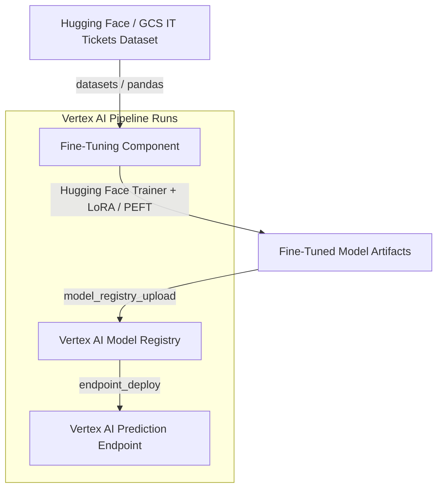
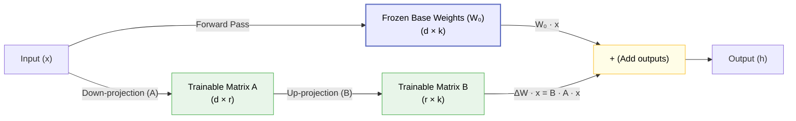
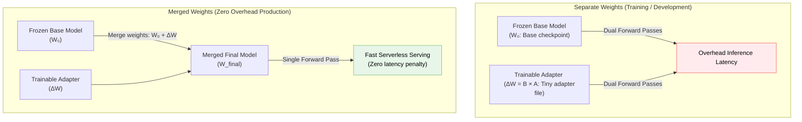

# Lab 03: IT Support Ticket LLM Fine-Tuning & Deployment Pipeline

This lab implements an end-to-end MLOps pipeline on Google Cloud Platform to fine-tune a pre-trained LLM (like `gpt2` or `Qwen2.5-0.5B-Instruct`) on a dataset of IT support tickets using Hugging Face **PEFT (LoRA)**, register the resulting model version in the Vertex AI Model Registry, and serve it via a Vertex AI prediction endpoint.

---

## 🏗️ Cloud-Native Architecture



1. **Declarative Terraform**: Deploys the GCS bucket for model checkpoints, Artifact Registry for containers, custom Service Account, and IAM bindings. Managed via **Infrastructure Manager**.
2. **Kubeflow Pipeline (`pipeline/`)**:
   * **Fine-Tuning (`train_gpt2_sft_job`)**: Launches a single-GPU custom training job on Vertex AI using our custom fine-tuning container. Fine-tunes the base model via Hugging Face SFTTrainer and uploads the merged weights to GCS.
   * **Serving Deployment (`deploy_model_to_endpoint`)**: Registers the new model version in the Vertex AI Model Registry and deploys it to a Vertex AI Endpoint using our custom serving container.

---

## 🧠 SFT & LoRA Concept Deep-Dive

### 1. Supervised Fine-Tuning (SFT)
A pre-trained base LLM is trained on general internet text to predict the next word. While highly capable, it doesn't know how to follow instructions or act as an assistant. **Supervised Fine-Tuning (SFT)** feeds structured prompt-response pairs (like Support Ticket -> Resolution Answer) to teach the model to behave as an interactive assistant.

### 2. Low-Rank Adaptation (LoRA)
Fine-tuning all billions of parameters in a base model (full fine-tuning) is computationally expensive, slow, and requires massive GPU memory. **LoRA (Low-Rank Adaptation)** freezes the original base model weights and inserts tiny trainable weight matrices into attention layers. 

Instead of updating a huge weight matrix $W_0$ of size $(d \times k)$ directly:
$$\Delta W = B \times A$$
where $B$ is a matrix of size $(d \times r)$ and $A$ is a matrix of size $(r \times k)$.
By choosing a small rank $r$ (e.g. $r=8$), we reduce the number of parameters to train by **over 99%**, saving GPU memory and accelerating training time.

#### Parameter Reduction Analysis (GPT-2 124M Base Model)
Applying LoRA to the attention projection layers (`c_attn` of size $768 \times 2304$, across all 12 transformer layers):

| Fine-Tuning Type | Rank ($r$) | Trainable Parameters | % of Base Model (124M) | Parameter Reduction |
| :--- | :--- | :--- | :--- | :--- |
| **Full Fine-Tuning** | *N/A* | 124,439,808 | 100.0000% | *None* |
| **LoRA** | **r = 64** | 2,359,296 | 1.8960% | **98.1040%** |
| **LoRA** | **r = 32** | 1,179,648 | 0.9480% | **99.0520%** |
| **LoRA** | **r = 16** | 589,824 | 0.4740% | **99.5260%** |
| **LoRA (Default)** | **r = 8** | 294,912 | 0.2370% | **99.7630%** |
| **LoRA** | **r = 4** | 147,456 | 0.1185% | **99.8815%** |
| **LoRA** | **r = 1** | 36,864 | 0.0296% | **99.9704%** |



### 3. What is an Adapter?
The small, trainable matrices ($A$ and $B$) inserted by LoRA are called **adapters**. During training, only these adapter weights are updated. The frozen base model weights remain untouched. The final saved checkpoints represent only these lightweight adapter files (often just a few megabytes!).

### 4. Model Merging (Merge & Unload)
Since the base model and adapters are separate files, loading both at prediction time adds inference latency because every layer must compute both the frozen base projections and the adapter projections. 

To solve this, we **merge** the weights before serving:
$$W_{final} = W_0 + \Delta W$$
This merges the adapter weights permanently back into the base model weights, resulting in a single standard transformer model directory. This eliminates any serving latency penalty!



---

## 📁 File Structure

```text
03_model_fine_tuning/
├── README.md                           # Lab 3 specific documentation
├── pipeline/
│   ├── pipeline.py                    # Kubeflow Pipeline definition
│   └── run_pipeline.py                 # Pipeline compiler & runner script
├── src/
│   ├── training/
│   │   ├── Dockerfile                  # Fine-tuning container
│   │   ├── requirements.txt
│   │   └── finetune.py                 # HF SFT / Trainer code
│   └── prediction/
│       ├── Dockerfile                  # Prediction serving container
│       ├── requirements.txt
│       └── main.py                     # Flask serving script (loading fine-tuned weights)
└── terraform/
    ├── main.tf                         # GCP resources (Artifact Registry, GCS, IAM)
    ├── variables.tf
    └── terraform.tfvars
```

---

## 🚀 Getting Started

### 1. (Optional) Prepare the Kaggle Dataset
If you want to use the Kaggle `synthetic-it-support-tickets` dataset manually:
1. Download the dataset zip file from [Kaggle](https://www.kaggle.com/datasets/ahsanneural/synthetic-it-support-tickets).
2. Upload the extracted `synthetic_it_support_tickets.csv` file directly to your pipeline GCS bucket:
   ```bash
   gcloud storage cp synthetic_it_support_tickets.csv gs://<YOUR_GCS_BUCKET_NAME>/dataset/synthetic_it_support_tickets.csv
   ```
If you do not upload a custom GCS CSV path, the pipeline automatically falls back to streaming and tokenizing the public Hugging Face mirror dataset `enzo-joseph/customer-support-tickets` (English subset).

### 2. Deploy Infrastructure
Deploy the required GCP resources using Infrastructure Manager:
```bash
gcloud infra-manager deployments apply gpt2-lab3-infra \
    --project=<YOUR_PROJECT_ID> \
    --location=us-central1 \
    --artifacts-gcs-bucket=gs://<YOUR_SHARED_PIPELINES_BUCKET>/deployments_lab3 \
    --local-source="03_model_fine_tuning/terraform" \
    --service-account="projects/<YOUR_PROJECT_ID>/serviceAccounts/infra-manager-sa@<YOUR_PROJECT_ID>.iam.gserviceaccount.com"
```

### 3. Build Container Images
Build the fine-tuning training and prediction serving containers and push them to the newly created Artifact Registry repository:
```bash
# Build Training Container
gcloud builds submit --tag us-central1-docker.pkg.dev/<YOUR_PROJECT_ID>/gpt2-finetuning-images/gpt2-ft-train:latest 03_model_fine_tuning/src/training

# Build Serving Container
gcloud builds submit --tag us-central1-docker.pkg.dev/<YOUR_PROJECT_ID>/gpt2-finetuning-images/gpt2-ft-predict:latest 03_model_fine_tuning/src/prediction
```

### 4. Run the Pipeline
Run the compiler and runner python script to launch the SFT fine-tuning and deployment pipeline run on Vertex AI:
```bash
python 03_model_fine_tuning/pipeline/run_pipeline.py \
    --project-id <YOUR_PROJECT_ID> \
    --bucket-name <YOUR_GCS_BUCKET_NAME> \
    --pipeline-sa gpt2-finetune-pipeline-sa@<YOUR_PROJECT_ID>.iam.gserviceaccount.com \
    --training-image us-central1-docker.pkg.dev/<YOUR_PROJECT_ID>/gpt2-finetuning-images/gpt2-ft-train:latest \
    --serving-image us-central1-docker.pkg.dev/<YOUR_PROJECT_ID>/gpt2-finetuning-images/gpt2-ft-predict:latest
```

---

## 🔮 Verification & Prediction

Once the pipeline completes successfully and the model is deployed, send a prediction request using the following format:

**Headers:**
`Content-Type: application/json`

**Body JSON:**
```json
{
  "instances": [
    {
      "prompt": "Our office printer is displaying an error code E203 and won't print any documents.",
      "max_new_tokens": 60
    }
  ]
}
```

The model will respond with an IT support agent resolution text.
